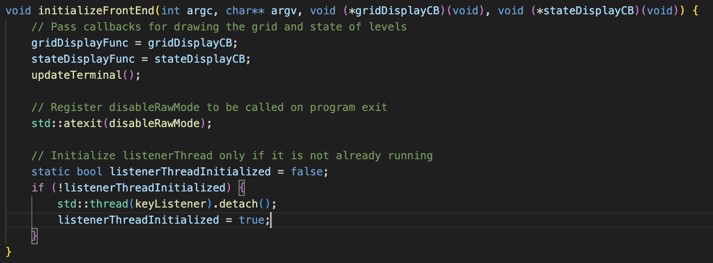
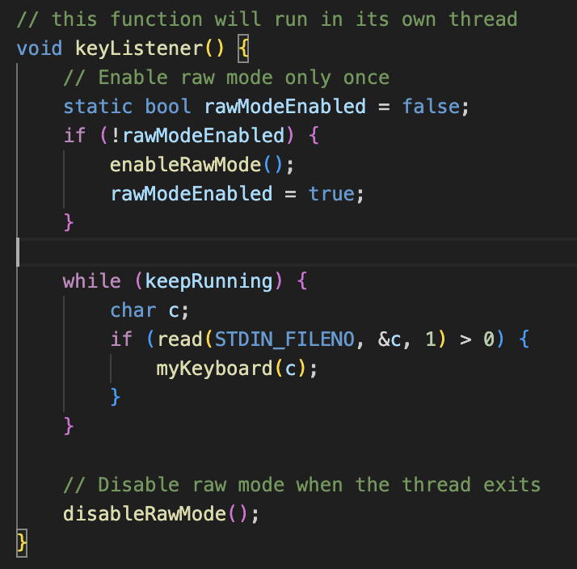
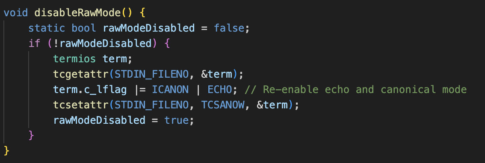
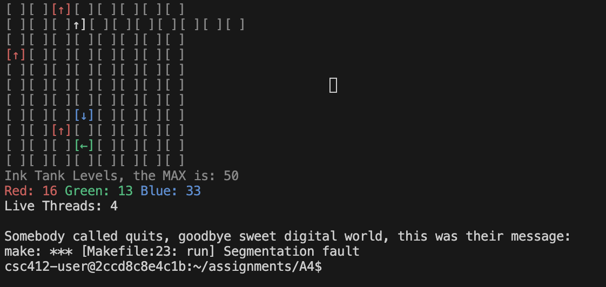
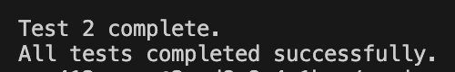

# Change 2: Ensure Proper Terminal Mode Handling and Dedicated Input Thread

## Proposed Change Summary

Building on Change 1, this change ensures proper terminal mode handling, improves input reliability, and adds robust cleanup mechanisms. It addresses issues with terminal mode conflicts, unreliable input handling, and improper cleanup when the program exits unexpectedly.

## Describe the Problem

The current implementation of `keyListener` mixes `std::cin` with low-level terminal handling, which can lead to undefined behavior and resource conflicts. Additionally, `enableRawMode` and `disableRawMode` are called multiple times, which can cause the terminal to behave unpredictably. If the program exits unexpectedly, the terminal may not be returned to the correct state.

## Describe the Solution

1. Ensure `enableRawMode` and `disableRawMode` are called only once:
    - Use a static boolean to track the terminal state.
    - Call `enableRawMode` exactly once at the start of `keyListener`.
    - Call `disableRawMode` exactly once during cleanup.
2. Use a dedicated input-handling thread:
    - Replace `std::cin` with `read(STDIN_FILENO, &c, 1)`.
    - Ensure proper synchronization to avoid mixing high-level and low-level input handling.
3. Initialize `listenerThread` in `initializeFrontEnd`:
    - Ensure the `listenerThread` is started exactly once.
    - Add a check to prevent duplication.
4. Update `disableRawMode` to include `std::atexit`:
    - Ensures `disableRawMode` is called regardless of how the program ends.
5. Make `disableRawMode` repeatable:
    - Ensure `disableRawMode` can be called multiple times without issues.

### Code Changes:

- Modify `keyListener` to use a dedicated input-handling thread:
    ```cpp
    while (true) {
        char c;
        if (read(STDIN_FILENO, &c, 1) > 0) {
        myKeyboard(c);
        }
    }
- Update `initializeFrontEnd` to initialize `listenerThread` and register `disableRawMode`:
    ```cpp
    std::atexit(disableRawMode);

    static bool listenerThreadInitialized = false;
    if (!listenerThreadInitialized) {
        std::thread(keyListener).detach();
        listenerThreadInitialized = true;
    }
- Make `disableRawMode` repeatable:
    ```cpp
    term.c_lflag |= ICANON | ECHO;

Benefits:
✔️ Prevents terminal mode conflicts.  
✔️ Improves input handling.  
✔️ Prevents duplicate threads.  
✔️ More robust cleanup and edge case handling.  

## Detailed Report of the Implemented Solution

The implemented solution addresses issues with terminal mode handling, input reliability, and cleanup robustness. The problem arose because the `keyListener` thread mixed `std::cin` with low-level terminal handling, leading to undefined behavior and resource conflicts. Additionally, `enableRawMode` and `disableRawMode` were called multiple times, causing terminal mode conflicts. If the program exited unexpectedly, the terminal was not returned to its initial state. To fix these issues, I introduced a dedicated input-handling thread, ensured proper terminal mode handling, and added robust cleanup mechanisms.

### Key Changes:

1. Ensure `enableRawMode` and `disableRawMode` are called only once:
    - Added a static bool flag to track whether raw mode is enabled.
    - Called `enableRawMode` exactly once at the start of `keyListener`.
    - Registered `disableRawMode` with `std::atexit` to ensure cleanup on program exit.
2. Use a dedicated input-handling thread:
    - Replaced `std::cin` with `read(STDIN_FILENO, &c, 1)` for low-level input handling.
    - Ensured proper synchronization to avoid mixing high-level and low-level input handling.
3. Initialize `listenerThread` in `initializeFrontEnd`:
    - Added a static bool flag `listenerThreadInitialized` to ensure the `listenerThread is started exactly once.
    - Detached the `listenerThread` to allow it to run independently.
4. Make `disableRawMode` repeatable:
    - Updated `disableRawMode` to ensure it can be called multiple times without issues.

### Code Screenshots

1. Declaration of `listenerThreadInitialized` and `std::atexit` in `initializeFrontEnd`:


2. Updated `keyListener()` Function:


3. Updated `disableRawModee` Function:


### Terminal Output:

Before implementing these changes, the terminal would sometimes behave unpredictably, and keyboard inputs were unreliable. After the fix, the terminal responds correctly to inputs, and the program exits cleanly, restoring the terminal to its initial state.



### Test Implementation:

To run bash script for testing:
1. Make the script executable
    ```cpp
    chmod +x test1_script.sh
2. Run script:
    ```cpp
    ./test1_script.sh
3. Expected output:

