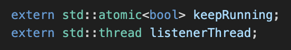
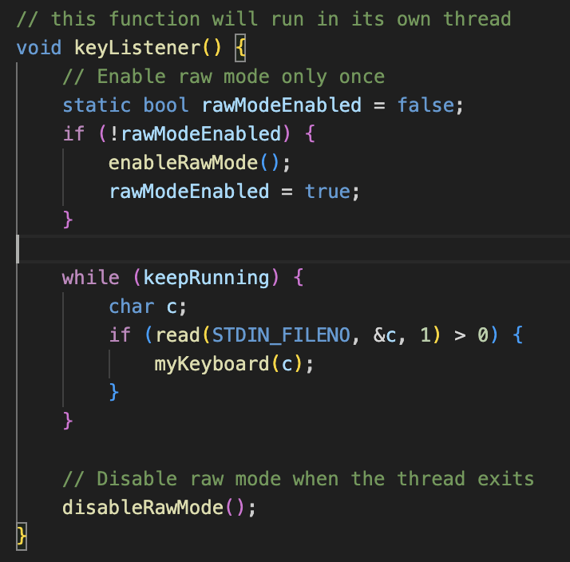

# Change 1: Add keepRunning Variable to Ensure Continuous Execution Without Duplication

## Proposed Change Summary

While working on A4, I noticed that uncommenting the `keyListener()` thread would sometimes lead to undefined behavior and resource conflicts. By adding a global variable to check that thread, this ensures it can run continuously without duplication.

## Describe the Problem

The `keyListener` thread is initialized in `initializeFrontEnd()` and could be started multiple times due to overlapping calls from `myEventLoop()`.

### Steps to Reproduce:

1. Run the program.
2. If `initializeFrontEnd()` or `myEventLoop()` is triggered again, the `keyListener` thread will be started again.
3. Multiple active threads listening for input lead to conflicting actions and race conditions.

### Observed Behavior:

- No response to keyboard inputs.
- Program instability due to thread conflicts.

## Describe the Solution

1. Added `keepRunning` as an `std::atomic<bool>` to control the lifecycle of the `keyListener` thread.
2. Initialized `keepRunning` to `true`.
3. Updated `keyListener()` to check `keepRunning` and terminate gracefully when set to `false`.
4. Ensured `listenerThread` is only created once by checking if it is already running before starting.

### Code Changes:

- Declare `keepRunning` in `ascii_art.h`:
  ```cpp
  extern std::atomic<bool> keepRunning;
- Modify `keyListener()` to use `keepRunning`
    ```cpp
        while (keepRunning) { 
            char c;
            if (std::cin.get(c)) {
            myKeyboard(c);
            }
        }
- Update `initializeFrontEnd()` to avoid multiple threads and race conditions:
    ```cpp
    if (!listenerThread.joinable()) {
      listenerThread = std::thread(keyListener);
    }
### Benefits:

✔️ Prevents duplicate thread creation.  
✔️ Reduces resource conflicts and race conditions.  
✔️ Ensures predictable behavior for keyboard input.  

## Detailed Report of the Implemented Solution

The implemented solution addresses the issue of duplicate `keyListener` threads being created, which led to undefined behavior, resource conflicts, and race conditions. The problem arose because the `keyListener` thread could be started multiple times due to overlapping calls from `initializeFrontEnd()` and `myEventLoop()`. To fix this, I introduced a global `std::atomic<bool>` variable named `keepRunning` to control the lifecycle of the `keyListener` thread and ensure it runs continuously without duplication.

### Key Changes:

1. Added `keepRunning` Variable:
- Declared `keepRunning` as a global `std::atomic<bool>` and initialized it to true.
    - This variable ensures the `keyListener` thread runs only once and terminates gracefully when the program exits.
2. Modified `keyListener()` Function:
- The `keyListener` function now checks the `keepRunning` variable in a loop.
- It reads keyboard input and processes it using `myKeyboard()` only if `keepRunning` is true.
3. Updated `initializeFrontEnd()` Function:
- Added a static bool flag `(listenerThreadInitialized)` to ensure the `keyListener` thread is started only once.
- Detached the `keyListener` thread to allow it to run independently.

### Code Screenshots

1. Declaration of `keepRunning` and `listenerThread`:


2. Updated `keyListener()` Function:


3. Updated `initializeFrontEnd()` Function:


### Terminal Output:

Before implementing these changes, keyboard inputs would not register. After the fix, the program immediately responds correctly to keyboard inputs.


### Test Implementation:

To run bash script for testing:
1. Make the script executable
    ```cpp
    chmod +x test1_script.sh
2. Run script:
    ```cpp
    ./test1_script.sh
3. Expected output:

